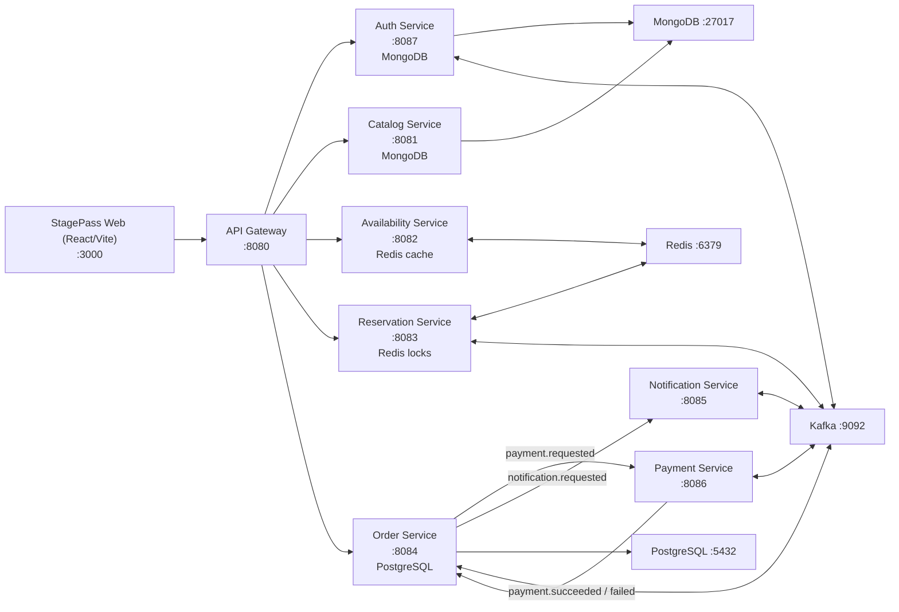

# <div align="center">🎟️ StagePass Ticketing Platform</div>

<div align="center">
  
  
  
  
  
  
</div>

<br />

**StagePass** is a production-style, event-driven ticketing system that covers the full lifecycle:
catalog management, seat availability, reservation locking, payments, order management, ticket PDFs, QR check-in, scanner operations, notifications, and an admin insights dashboard.

Designed to demonstrate **real-world backend architecture**, **clean frontend engineering**, and **operational thinking** suitable for senior-level interviews and portfolio reviews.

---

## ✨ Product Highlights

- **End-to-end booking flow**: discover events → hold seats → checkout → order confirmation
- **Anti-double-booking strategy** using Redis locking + hold expiry + availability synchronization
- **JWT-based auth** with role-based access (`USER`, `ADMIN`, `SCANNER`)
- **QR-based ticket check-in** with one-time scan enforcement and scanner restrictions
- **Admin scanner account management** with event-bound or global scanner behavior
- **Order lifecycle controls** including partial seat cancellation and policy-driven constraints
- **Notification pipeline** through Kafka and centralized email sending (verification + order tickets)
- **Modern React UI** with protected routes, role-aware navigation, and polished UX states

---

## 🧭 Table of Contents

- [System Architecture](#-system-architecture)
- [Core Services](#-core-services)
- [Domain Flows](#-domain-flows)
- [Tech Stack](#-tech-stack)
- [Project Layout](#-project-layout)
- [Local Development](#-local-development)
- [Runbook: Start & Verify](#-runbook-start--verify)
- [API Surface (Gateway)](#-api-surface-gateway)
- [Frontend (StagePass Web App)](#-frontend-stagepass-web-app)
- [Configuration & Environment](#-configuration--environment)
- [Quality, Testing, and Engineering Practices](#-quality-testing-and-engineering-practices)
- [Kubernetes](#-kubernetes)
- [Roadmap](#-roadmap)
- [License](#-license)

---

## 🏗️ System Architecture

### High-level topology



### Why this architecture is interview-strong

- **Service boundaries are explicit** (auth, catalog, reservation, order, payment, notification)
- **Synchronous + asynchronous orchestration** (HTTP for query/commands, Kafka for workflow events)
- **Read/write performance balance** (Redis cache/locks + PostgreSQL transactional persistence)
- **Operational realism** (gateway routing, role guards, message-driven side effects, dockerized infra)

---

## 🧩 Core Services

| Service | Port | Storage | Role |
|---|---:|---|---|
| `api-gateway` | 8080 | — | Single entrypoint for `/api/*`, forwards to internal services |
| `auth-service` | 8087 | MongoDB | Registration, login, token auth, role claims, scanner account lifecycle |
| `catalog-service` | 8081 | MongoDB | Shows, venue details, seating map, event metadata |
| `availability-service` | 8082 | Redis | Fast seat availability lookup and cache layer |
| `reservation-service` | 8083 | Redis | Seat hold lifecycle, lock acquisition/release, hold extension |
| `order-service` | 8084 | PostgreSQL | Orders, cancellation logic, ticket scan validation, admin metrics |
| `payment-service` | 8086 | — | Payment simulation worker (Kafka consumer/producer) |
| `notification-service` | 8085 | — | Email orchestration + PDF ticket generation + verification emails |

Shared modules:

- `ticketing-events`: shared Kafka event DTOs/contracts
- `ticketing-common`: cross-cutting exceptions, constants, auth helpers, mappers

---

## 🔄 Domain Flows

### 1) Booking flow
1. User selects seats for a show.
2. Reservation service acquires Redis seat locks (TTL-based hold).
3. Checkout creates order (`PAYMENT_PENDING`) in PostgreSQL.
4. Order service publishes `payment.requested`.
5. Payment service publishes `payment.succeeded` or `payment.failed`.
6. Order status transitions to `CONFIRMED` / `CANCELLED`.
7. Notification service receives request and sends confirmation email (+ ticket PDFs).

### 2) Ticket check-in flow
1. Ticket PDF contains signed QR token.
2. Scanner opens `/check-in?token=...`.
3. Order service validates token, order-seat ownership, event restrictions, and prior usage.
4. Scan result returned immediately: accepted / already used / invalid / expired.

### 3) Cancellation flow
- Supports seat-level and full-order cancellation.
- Enforces policy window and status transitions including `PARTIALLY_CANCELLED`.
- Restores seat availability for future purchases.

---

## 🛠️ Tech Stack

### Backend
- Java 21
- Spring Boot 3.2.x
- Spring Cloud Gateway
- Spring Data (MongoDB + JPA/PostgreSQL)
- Spring Security + JWT
- Kafka (event-driven messaging)
- Redis (cache + distributed locks)
- Maven (multi-module build)

### Frontend
- React 18 + TypeScript
- Vite 5
- TanStack Query
- React Router
- Tailwind CSS

### Infra / Ops
- Docker + Docker Compose
- Kafka + Zookeeper
- Admin tools: Adminer, Redis Commander
- Kubernetes manifests (`k8s/`)

---

## 🗂️ Project Layout

```text
ticketing-system/
├── api-gateway/
├── auth-service/
├── catalog-service/
├── availability-service/
├── reservation-service/
├── order-service/
├── payment-service/
├── notification-service/
├── ticketing-common/
├── ticketing-events/
├── frontend/
├── k8s/
├── docker-compose.yml
├── pom.xml
└── README.md
```

---

## 🚀 Local Development

### Prerequisites

- Docker Desktop
- Java 21
- Node.js 18+ (or 20+ recommended)
- Maven (`mvn`) installed (or use your wrapper setup)

### 1) Start full stack with Docker Compose

```bash
docker compose up -d
```

Primary local endpoints:

- Frontend: `http://localhost:3000`
- API Gateway: `http://localhost:8080`
- Swagger docs:
  - Auth: `http://localhost:8087/swagger-ui.html`
  - Catalog: `http://localhost:8081/swagger-ui.html`
  - Availability: `http://localhost:8082/swagger-ui.html`
  - Reservation: `http://localhost:8083/swagger-ui.html`
  - Order: `http://localhost:8084/swagger-ui.html`
- Adminer (Postgres UI): `http://localhost:5551`
- Redis Commander: `http://localhost:5540`

### 2) Run frontend locally (optional if not containerized)

```bash
cd frontend
npm install
npm run dev
```

---

## ✅ Runbook: Start & Verify

### Build all Java modules

```bash
mvn clean install
```

### Start services manually (if not using compose apps)

```bash
mvn -pl auth-service spring-boot:run
mvn -pl catalog-service spring-boot:run
mvn -pl availability-service spring-boot:run
mvn -pl reservation-service spring-boot:run
mvn -pl order-service spring-boot:run
mvn -pl payment-service spring-boot:run
mvn -pl notification-service spring-boot:run
mvn -pl api-gateway spring-boot:run
```

### Quick health checks

- `GET http://localhost:8080/api/shows`
- Login/register through frontend and validate protected navigation by role
- Execute seat hold + checkout flow and confirm order email behavior

---

## 🌐 API Surface (Gateway)

Gateway base URL: `http://localhost:8080`

| Domain | Method | Path | Description |
|---|---|---|---|
| Auth | POST | `/api/auth/register` | Register user |
| Auth | POST | `/api/auth/login` | Login (returns JWT) |
| Auth | GET | `/api/auth/me` | Current user profile |
| Catalog | GET | `/api/shows` | List shows |
| Catalog | GET | `/api/shows/{id}` | Show details |
| Catalog | POST | `/api/shows` | Admin create show |
| Availability | GET | `/api/availability/{showId}` | Seat availability |
| Reservation | POST | `/api/reservations/hold` | Batch hold seats |
| Reservation | POST | `/api/reservations/release` | Batch release seats |
| Reservation | POST | `/api/reservations/extend-hold` | Extend hold TTL |
| Orders | POST | `/api/orders` | Create order |
| Orders | GET | `/api/orders/me` | User order history |
| Orders | GET | `/api/orders/me/{orderId}` | User order details |
| Orders | POST | `/api/orders/check-in/scan` | Scanner/admin ticket scan |
| Orders | GET | `/api/orders/admin/metrics` | Admin metrics dashboard |

---

## 🎨 Frontend (StagePass Web App)

The frontend includes:

- Home discovery with upcoming/past event segmentation
- Seat selection and hold timer experience
- Checkout + order confirmation flow
- My Orders pages (USER only)
- Admin workflows (create/edit/manage shows, scanner management, metrics)
- Scanner check-in interface with immediate scan feedback
- Modern 404 page and role-aware protected routing

Useful scripts:

```bash
cd frontend
npm run dev
npm run build
npm run lint
```

---

## ⚙️ Configuration & Environment

The stack is configured mainly via `docker-compose.yml`. Key variables include:

| Variable | Purpose |
|---|---|
| `JWT_SECRET` | Shared JWT signing/validation secret |
| `KAFKA_BOOTSTRAP_SERVERS` | Kafka broker address |
| `POSTGRES_*` | Order service database connectivity |
| `MONGODB_HOST` / `MONGODB_PORT` | Mongo services connectivity |
| `REDIS_HOST` / `REDIS_PORT` | Redis cache/lock backend |
| `AUTH_SEED_DEFAULT_SCANNER_*` | Default scanner bootstrap account |
| `ORDER_CANCELLATION_*` | Cancellation policy switches and cutoff |
| `MAIL_*` + `NOTIFICATION_EMAIL_*` | SMTP and sender configuration |
| `TICKET_QR_CHECKIN_URL_BASE` | URL encoded in generated ticket QR |

> Security note: do not commit real production secrets in public repositories. Use `.env`, secret managers, or CI/CD secure variables.

---

## 🧪 Quality, Testing, and Engineering Practices

- Clean architecture boundaries by service responsibility
- SOLID-driven interfaces and mappers for low coupling
- Event contracts centralized in shared module
- Testcontainers-based integration tests for critical flows (reservation/order)
- Role-based route guards in frontend and claim-based authorization in backend
- Defensive error handling for race conditions (e.g., duplicate scans)

Run sample tests:

```bash
mvn -pl reservation-service test
mvn -pl order-service test
```

---

## ☸️ Kubernetes

Kubernetes manifests live under `k8s/` and include:

- Namespace
- Infrastructure manifests (Postgres, MongoDB, Redis, Kafka, Zookeeper)
- Service deployments + services
- Ingress configuration
- Horizontal Pod Autoscalers

For apply sequence and image instructions, see `k8s/README.md`.

---

## 🛣️ Roadmap

- [x] Event-driven payment and notification services
- [x] JWT auth + role-based guards (USER / ADMIN / SCANNER)
- [x] QR ticket generation and secure scan endpoint
- [x] Scanner account lifecycle and event-scoped permissions
- [x] Admin metrics dashboard (global + per-event)
- [x] Polished UX flows (orders, cancellation, 404, admin nav)
- [ ] Add observability dashboards (Prometheus/Grafana/OpenTelemetry)
- [ ] Introduce CI pipeline for lint/test/build/deploy automation

---

## 📄 License

Proprietary - All rights reserved.
